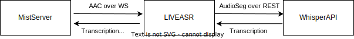

# Livepeer Automatic Speech Recognition

## Overview
LIVEASR is a real time automatic speech recognition server based on OpenAI Whisper.

## Architecture


## Build
```
git clone https://github.com/livepeer/interactive-video.git 
cd interactive-video/liveasr
go build cmd/example/transcribe.go
```

## Test
### Create stream at mistserver
- In the mistserver, click Streams > Create a new stream
- In the new stream edit window, create a new LivepeerText stream process. This process opens a websocket to LIVEASR server, sends AAC packets and receives transcription results. MistServer processes the transcription results and serves the subtitled HLS at http://<mistserveraddress>:8080/hls/<streamname>/index.m3u8


### Start WhisperAPI
Go to the main directory of interactive-video repo then go to the whisperapi directory.
```
cd whisper_api
gunicorn -w 1 -b 0.0.0.0:5000 --timeout 300 wsgi:app
```

### Start liveasr

```
./transcribe -addr <ip:port> -duration <audio segment duration>
```

### Start Streaming and View Subtitled HLS
Start streaming using your favorite streaming app(i.e. OBS Studio)
Stream Link is at:
```
rtmp://<mistserveraddr>:1935/live/<streamname>
```

HLS stream can be viewed at http://<mistserveraddress>:8080/hls/<streamname>/index.m3u8


