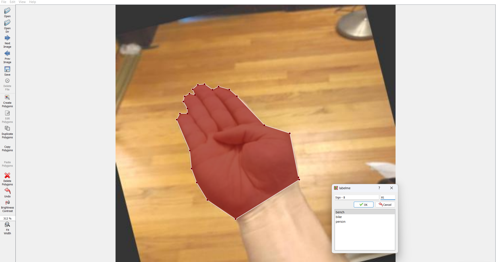

# Training instance segmentation model on custom dataset
In order to create a custom model that detects your custom objects, you need to collect images, label images, train and deploy it to the wild. You can either choose to train a model that detects only your custom objects or detects all the objects in the pretrained model (on coco dataset with 80 classes of objects) plus your custom objects.

## 1. Create Dataset

### Using our labeling tool to label the images.

Label images using polygon tool. If you are labeling images to train a model that detects coco classes + your custom classes, make sure you start the class ID at 80. 



Save the annotation file and convert it to yolo format.
```
./labelme2yolo.py data_annotated data_dataset_coco --labels labels.txt
```

Create data.yml file. 

If you are merging new dataset to coco, merge the dataset like below.
```
path: ../datasets
train: 
  - coco/images/train2017
  - train/images

val:
  - coco/images/val2017
  - valid/images


nc: 106
# Classes
names:
  0: person
  1: bicycle
  2: car
  3: motorcycle
  4: airplane
  5: bus
  6: train
  7: truck
  8: boat
  9: traffic light
  10: fire hydrant
  11: stop sign
  12: parking meter
  13: bench
  14: bird
  15: cat
  16: dog
  17: horse
  18: sheep
  19: cow
  20: elephant
  21: bear
  22: zebra
  23: giraffe
  24: backpack
  25: umbrella
  26: handbag
  27: tie
  28: suitcase
  29: frisbee
  30: skis
  31: snowboard
  32: sports ball
  33: kite
  34: baseball bat
  35: baseball glove
  36: skateboard
  37: surfboard
  38: tennis racket
  39: bottle
  40: wine glass
  41: cup
  42: fork
  43: knife
  44: spoon
  45: bowl
  46: banana
  47: apple
  48: sandwich
  49: orange
  50: broccoli
  51: carrot
  52: hot dog
  53: pizza
  54: donut
  55: cake
  56: chair
  57: couch
  58: potted plant
  59: bed
  60: dining table
  61: toilet
  62: tv
  63: laptop
  64: mouse
  65: remote
  66: keyboard
  67: cell phone
  68: microwave
  69: oven
  70: toaster
  71: sink
  72: refrigerator
  73: book
  74: clock
  75: vase
  76: scissors
  77: teddy bear
  78: hair drier
  79: toothbrush
  80: A
  81: B
  82: C
  83: D
  84: E
  85: F
  86: G
  87: H
  88: I
  89: J
  90: K
  91: L
  92: M
  93: N
  94: O
  95: P
  96: Q
  97: R
  98: S
  99: T
  100: U
  101: V
  102: W
  103: X
  104: Y
  105: Z
```

The directory structure looks like below.


### Using Roboflow to label your custom data. 

When you export, make sure you export it in yolov7 torch format.


## 2. Train
Train a YOLOv7 segmentation model on the dataset that you have prepared.
```
cd smartav_api/instance_segmentation

python segment/train.py --data data-custom.yaml --batch 8 --weights '' --cfg yolov7-seg.yaml --epochs 100 --name yolov7-seg --img 32 --hyp hyp.scratch-high.yaml
```
After training is completed, there will be best.pt file. This is the model file that you can use to detect custom objects.